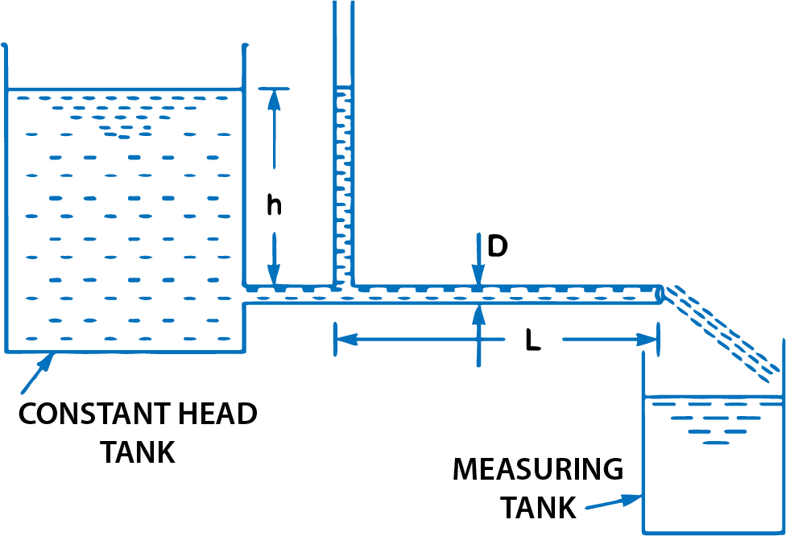
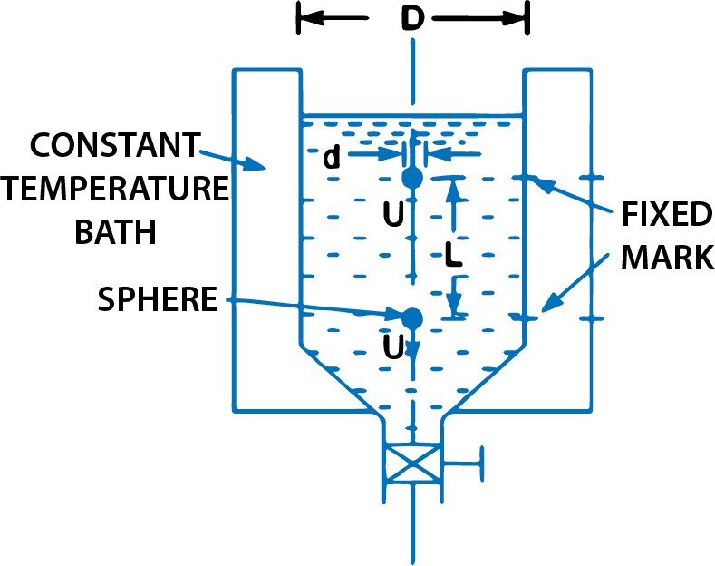
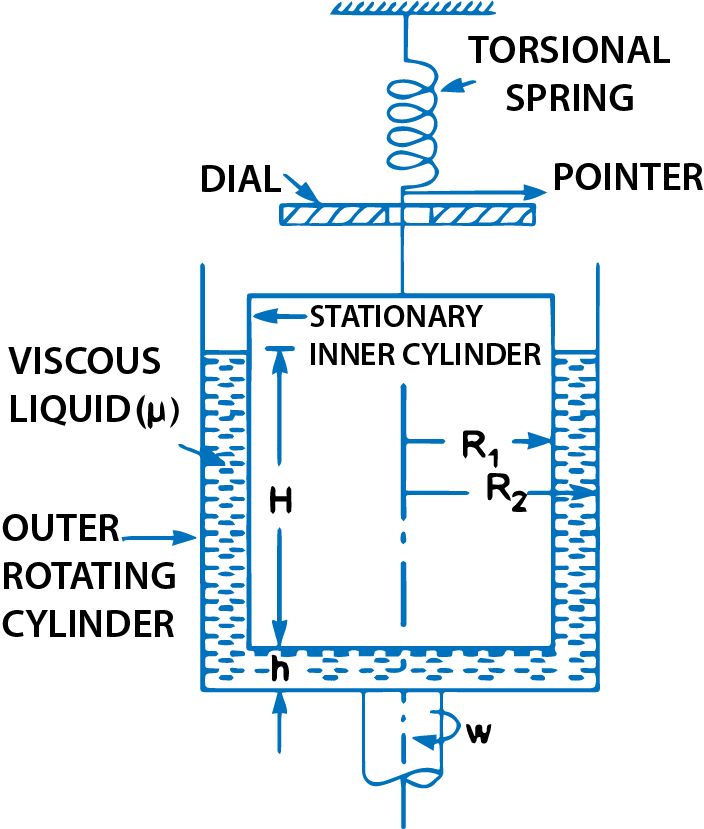
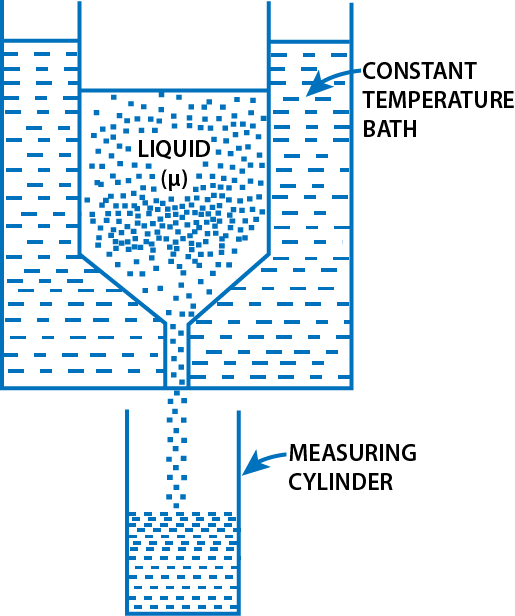

<h3>Methods of determination of co-efficient of viscosity</h3>

    The following are the experimental methods of determining the co-efficient of viscosity of a liquid:

<ol>
    <li>Capillary tube method</li>
    <li>Falling sphere resistance method</li>
    <li>By rotating cylinder method</li>
    <li>Orifice type viscometer</li>
</ol>

The apparatus used for determining the viscosity of a liquid is called viscometer.

<h3>Capillary Tube Method</h3>

    In capillary tube method, the viscosity of a liquid is calculated by measuring the pressure difference for a given length of the capillary tube. The Hagen Poiseuille law is used for calculating viscosity.

$$ Fig\ 1.\ \ Capillary\ tube\ viscometer $$

    Fig 1. shows the capillary tube viscometer. The liquid whose viscosity is to be determined is filled in a constant head tank. The liquid is maintained at constant temperature and is allowed to pass through the capillary tube from the constant head tank. Then, the liquid is collected in a measuring tank for a given time. Then the rate of liquid collected in the tank per second is determined. The pressure head 'h' is measured at a point far away from the tank as shown in Fig 1.

Then  
&emsp; The pressure at outlet is atmospheric.  
&emsp; D = Diameter of capillary tube,  
&emsp; L = Length of tube for which difference of pressure head is known,  
&emsp; p = Density of fluid,  
&emsp; u = Co-efficient of viscosity.

Using Hagen Poiseuille's Formula,
$$ h=\frac{32 \mu \overline{u}L}{\rho g D^{2}} $$

But

$$ \overline{u}=\frac{Q}{Area}=\frac{Q}{\frac{\pi}{4}D^{2}} $$

where Q is rate of liquid flowing through tube.

$$ h = \frac{32 \mu * \frac{Q}{\frac{\pi}{4}D^2} * L }{\rho g D^2} = \frac{128 \mu QL}{\pi \rho g D^2} $$

or

$$ \mu = \frac{128\mu~Q,L}{\pi\rho gD^{4}} $$

Measurement of D should be done very accurately.

<h3>Falling Sphere Resistance Method</h3>

This method is based on Stoke's law, according to which the drag force, F, on a small sphere moving with a constant velocity, U, through a viscous fluid of viscosity, μ, for viscous conditions: 
 
$$ F = 6 \pi \mu U $$
$$ F = 3 \pi \mu U d ...(i) $$

where:
<ul>
    <li>d = diameter of sphere</li>
    <li>U = velocity of sphere</li>
</ul>

$$ Fig\ 2.\ \ Falling\ sphere\ resistance\ method $$

When the sphere attains a constant velocity U, the drag force is the difference between the weight of sphere and buoyant force acting on it.

   

Let

<ul>
    <li>L = distance travelled by sphere in viscous fluid</li>
    <li>t = time taken by sphere to cover distance L</li>
    <li>&#961;s = density of sphere</li>
    <li>&#961;f = density of fluid</li>
    <li>W = weight of sphere</li>
    <li>FB = buoyant force acting on sphere</li>
</ul>

Then constant velocity, U = L/t

Weight of sphere, W = volume of sphere x density of sphere x g

$$ = \frac{\pi}{6}d^3 \times \rho_s \times g $$

and buoyant force, FB = weight of fluid displaced = volume of liquid displaced * density of fluid * g 

$$ = \frac{\pi}{6}d^3 \times \rho_f \times g $$ 

$$ [volume \ of \ liquid \ displaced = volume\ of\ sphere] $$

For equilibrium,

Drag force = Weight of sphere - buoyant force

or F = W - FB

Substituting the values of F, W and FB we get

$$ 3\pi\mu U d = \frac{\pi}{6}d^3 \times \rho_s \times g - \frac{\pi}{6}d^3 \times \rho_f \times g = \frac{\pi}{6}d^3 \times g [\rho_s - \rho_f] $$

or

$$ \mu = \frac{\pi}{6} \frac{d^3 \times g (\rho_s - \rho_f)}{3\pi U d} = \frac{gd^2}{18U} [\rho_s - \rho_f)] $$

or

$$ \mu = \frac{gd^2}{18U} [\rho_s - \rho_f] ...(2) $$

where &#961;f = Density of liquid

Hence in equation (2), the values of d, U, &#961;s, and &#961;f are known and hence the viscosity of liquid can be determined.

Thus this method consists of a tall vertical transparent cylindrical tank, which is filled with the liquid whose viscosity is to be determined. This tank is surrounded by another transparent tank to keep the temperature of the liquid in the cylindrical tank to be constant. A spherical ball of small diameter 'd' is placed on the surface of liquid. Provision is made to release this ball. After a short distance of travel, the ball attains a constant velocity. The time to travel a known vertical distance between two fixed marks on the cylindrical tank is noted to calculate the constant velocity U of the ball. Then with the known values of d, &#961;s, &#961;f, the viscosity &#956; of the fluid is calculated by using equation (2).

<h3>Rotating Cylinder Method</h3>

This method consists of two concentric cylinders of radii R1 and R2, as shown in Fig 3. The narrow space between the two cylinders is filled with the liquid whose viscosity is to be determined. The inner cylinder is held stationary by means of a torsional spring while the outer cylinder is rotated at a constant angular speed &#969;. The torque T acting on the inner cylinder is measured by the torsional spring. The torque on the inner cylinder must be equal and opposite to the torque applied on the outer cylinder.

$$ Fig\ 3.\ \ Rotating\ cylinder\ viscometer $$

The torque applied on the outer cylinder is due to viscous resistance provided by liquid in the annular space and at the bottom of the inner cylinder.

Let &#969; = angular speed of outer cylinder

Tangential (peripheral) speed of outer cylinder = &#969; * R2

Velocity of liquid layer with outer cylinder = &#969; * R2

Velocity of liquid layer with inner cylinder = 0

Velocity gradient over the radial distance (R2 - R1)

$$ = \frac{du}{dy} = \frac{\omega R_2 - 0}{R_2 - R_1} = \frac{\omega R_2}{R_2 - R_1} $$

Shear stress (&#964;) 

$$ = \mu \frac{du}{dy} = \mu \frac{\omega R_2}{R_2 - R_1} $$ 

Shear force (F) = shear stress * area of surface

$$ = \tau \times 2\pi R_1 H $$

$$ = \mu \frac{\omega R_2}{R_2 - R_1} \times 2\pi R_1 H $$

The torque T1 on the inner cylinder due to shearing action of the liquid in the annular space is

T1 = shear force * radius

$$ = \mu \frac{\omega R_2}{R_2 - R_1} \times 2\pi R_1 H \times R_1 $$

$$ = \frac{2\pi \mu \omega H R_1^2 R_2}{R_2 - R_1} ...(i) $$

If the gap between the bottom of the two cylinders is 'h', then the torque applied on inner cylinder (T2) is given by equation as

 $$ T_2 = \frac{\mu}{60h} \pi^2 N R_1^4 $$

But here

$$ R = R_1, t = h\ then\ T_2 = \frac{\mu}{60h} \pi^2 N R_1^4 $$

$$ ω = \frac{2\pi N}{60} $$

$$ N = \frac{60ω}{2\pi} $$

or

$$ T_2 = \frac{\mu}{60h} \times \pi^2 \times \frac{60ω}{2\pi} \times R_1^4 = \frac{\pi \mu \omega}{2h} R_1^4 $$

Total torque T acting on the inner cylinder is

$$ T = T_1 + T_2 $$

$$ = \frac{2\pi \mu \omega H R_1^2 R_2}{R_2 - R_1} + \frac{\pi \mu \omega}{2h} R_1^4 = 2\pi \mu R_1^2 [\frac{R_2 H}{R_2 - R_1} + \frac{R_1^2}{4h}] \times ω ...(ii) $$

$$ μ = \frac{2πR_1^2(R_2 - R_1)T}{ωH[4R_1R_2 + R_1^2 - R_2^2]} ...(3) $$

where:
<ul>
    <li>T = torque measured by the strain of the torsional spring.</li>
    <li>R1, R2 = radii of inner and outer cylinders.</li>
    <li>h = clearance at the bottom of cylinders.</li>
    <li>H = height of liquid in annular space.</li>
    <li>&#956; = co-efficient of viscosity to be determined.</li>
</ul>

Hence, the value of μ can be calculated from equation (3).

<h3>Orifice Type Viscometer</h3>

In this method, the time taken by a certain quantity of the liquid whose viscosity is to be determined, to flow through a short capillary tube is noted down. The co-efficient of viscosity is then obtained by comparing with the co-efficient of viscosity of a liquid whose viscosity is known or by the use conversion factors.

Viscometers such as Saybolt, Redwood or Engler are usually used. The principle for all the three viscometer is same. In the United Kingdom, Redwood viscometer is used while in U.S.A., Saybolt viscometer is commonly used.

$$ Fig\ 4.\ \ Saybolt\ viscometer $$

Fig 4. shows that Saybolt viscometer, which consists of a tank at the bottom of which a short capillary tube is fitted. In this tank the liquid whose viscosity is to be determined is filled. This tank is surrounded by another tank, called constant temperature bath. The liquid is allowed to flow through capillary tube at a standard temperature. The time taken by 60 c.c. of the liquid to flow through the capillary tube is noted down. The initial height of liquid in the tank is previously adjusted to a standard height. From the time measurement, the kinematic viscosity of liquid is known from the relation,
   
   
$$ v = At - \frac{B}{t} $$
   

where A = 0.24, B = 190, t = time noted in seconds, v = kinematic viscosity in stokes. 
